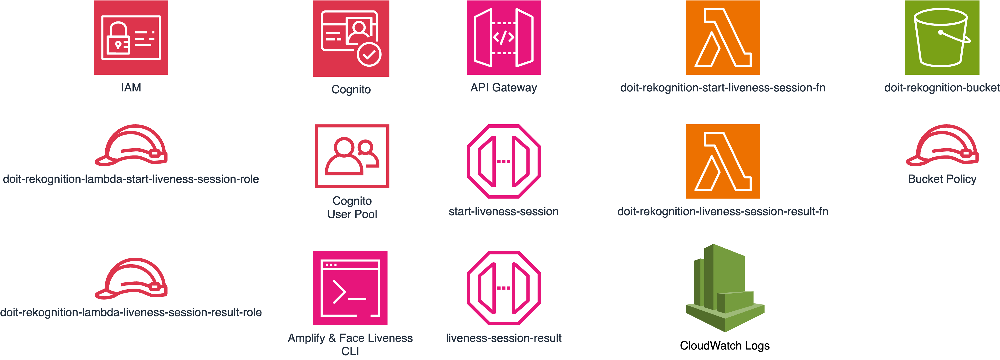
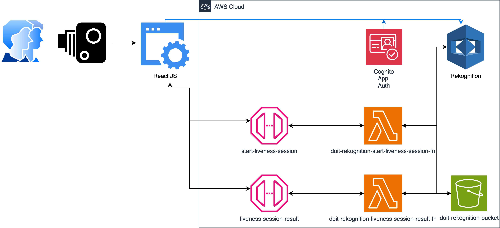

# Rekognition - Face Liveness
Creates a solution that invokes Rekognition - Face Liveness feature. This validates if a real live human is standing in front of a camera. Use case is to prevent fraud for example when auth'ing a person for entry, etc. Stops a person from holding up a picture of someone else to auth. Think Mission Impossible!

## Note
These are typically POC labs and do not feature production hardened solutions. Please ensure if used, you implement best practice security and auth controls where necessary. 

In saying that, all IAM created is typically with least privilege, but public facing services may need additional auth.

## Getting Started
Open the notebooks and Python files in Jupyter or any compatible environment and follow the instructions provided in each.

## What is Created

## Workflow
